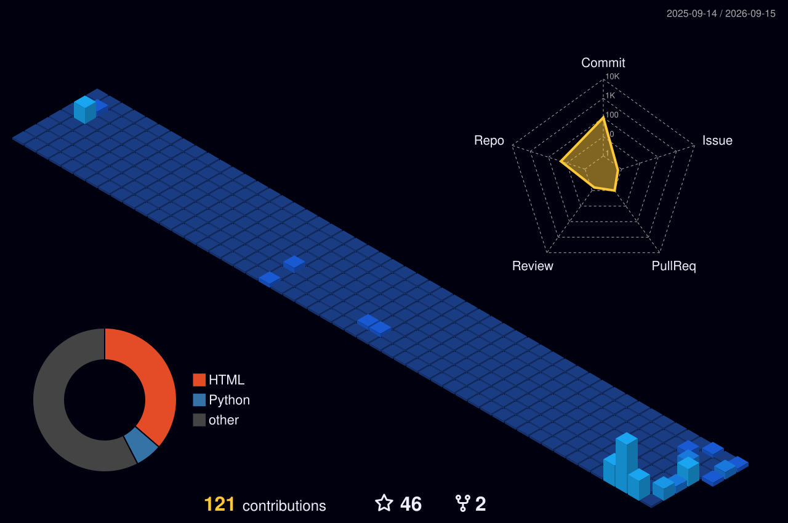

<h1 align="center">Hola , I'm M Vijesh</h1>
<h3 align="center">Software Engineer & Developer. Dedicated to system design, optimization, and automation. Open to collaborating on innovative tech projects.</h3>

  

- 📫 How to reach me **vijeshm331@gmail.com**

<h3 align="left">Connect with me:</h3>

   

## My Skill Set  
<table><tr><td valign="top" width="33%">

### Languages  

  
  
  
  
  
  
  

</td><td valign="top" width="33%">

### Frontend  

  
  
  
  
  

</td><td valign="top" width="33%">

### Backend & Database  

  
  
  
  
  
  
  
  

</td></tr></table>  

   

<table><tr><td valign="top" width="50%">

### AI/ML  

  
  
  
  

</td><td valign="top" width="50%">

### Tools & Others  

  
  
  
  
  
  
  
  
  
 
    

</td></tr></table>
 

----

  <h2>Advanced GitHub Telemetry</h2>

 
----
